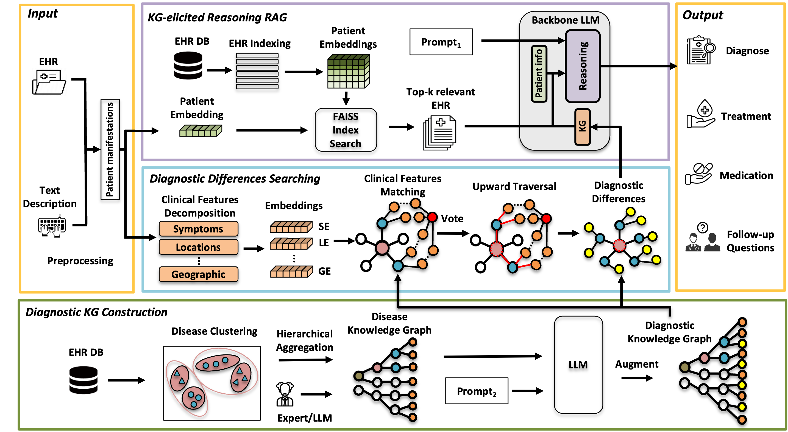

# MedRAG: Enhancing Retrieval-augmented Generation with Knowledge Graph-Elicited Reasoning for Healthcare Copilot

<a href='https://arxiv.org/abs/2502.04413'></a>

✅ This paper has been accepted by [The Web Conference (WWW) 2025](https://www2025.thewebconf.org/), and the demo of MedRAG has been accepted by [The 34th International Joint Conference on Artificial Intelligence (IJCAI) 2025](https://2025.ijcai.org/).

💻 This is the official implementation for our accepted paper [*MedRAG: Enhancing Retrieval-augmented Generation with Knowledge Graph-Elicited Reasoning for Healthcare Copilot*](https://arxiv.org/abs/2502.04413) and partial implementation for our accepted paper [*A Smart Multimodal Healthcare Copilot with Powerful LLM Reasoning*](https://arxiv.org/abs/2506.02470).

#### Authors
[Xuejiao Zhao*](https://zxjwudi.github.io/xuejiaozhao/),  [Siyan Liu*](https://scholar.google.com/citations?hl=zh-CN&user=v087WWIAAAAJ),  [Su-Yin Yang](https://www.linkedin.com/in/su-yin-yang-b4304355?originalSubdomain=sg),  [Chunyan Miao**](https://dr.ntu.edu.sg/cris/rp/rp00084)

**Nanyang Technological University  &nbsp; | &nbsp;  Tan Tock Seng Hospital &nbsp; |&nbsp; Woodlands Health**

\* Both authors contributed equally to the paper

\*\* Corresponding author

[](https://www.youtube.com/watch?v=PNIBDMYRfDM "Nanyang Technological University Launches Reasoning-Enhanced LLM for Healthcare Copilot")

---

## :fire: News
* **[2025.06.04]** Our demo paper accepted by IJCAI'25 is launched on [arXiv](https://arxiv.org/abs/2506.02470)! We introduced a novel voice modality with corresponding evaluations and conducted a comprehensive doctor evaluation. Check it out [here](https://github.com/SNOWTEAM2023/MedRAG/tree/main/appendix)!.
* **[2025.05.14]** Added [explanation](#usage) of the processed dataset file `AI Data Set with Categories.csv`, including guidance on dataset extension and feature customization.
* **[2025.04.10]** Removed unused imports and fixed missing module issue.
* **[2025.03.24]** MedRAG has recently drawn some interest from media outlets and bloggers, such as [Medium](https://medium.com/@jenray1986/medrag-revolutionizing-healthcare-with-knowledge-graph-enhanced-retrieval-augmented-generation-dda38cc9f447), [AI Era](https://mp.weixin.qq.com/s/XR7G3IZib0mbenSRFcP2NA), and [CSDN](https://blog.csdn.net/weixin_44292902/article/details/146162978?ops_request_misc=%257B%2522request%255Fid%2522%253A%2522f4075b96d8be4fda16fa4ccd41cc155f%2522%252C%2522scm%2522%253A%252220140713.130102334..%2522%257D&request_id=f4075b96d8be4fda16fa4ccd41cc155f&biz_id=0&utm_medium=distribute.pc_search_result.none-task-blog-2~all~baidu_landing_v2~default-5-146162978-null-null.142^v102^pc_search_result_base8&utm_term=medrag). Tks for all the support — we're continuing to improve! 🙏
* **[2025.03.12]** We release the officially generated [diagnostic knowledge graph for the DDXPlus dataset](https://github.com/SNOWTEAM2023/MedRAG/blob/b935c168f752adbd0a3afae00501f134709810d5/dataset/knowledge%20graph%20of%20DDXPlus.xlsx). Have a try!
* **[2025.02.25]** The [Chinese Demo](https://www.bilibili.com/video/BV1urPeemEZd/) of MedRAG is now available on Bilibili, and the [English Demo](https://youtu.be/PNIBDMYRfDM) is available on YouTube.
* **[2025.02.10]** MedRAG reported by the 'Quantum Heart' on [RedNote](https://www.xiaohongshu.com/explore/67a99975000000001800c6cd?app_platform=ios&app_version=8.69.4&share_from_user_hidden=true&xsec_source=app_share&type=normal&xsec_token=CBXfNU2SBF5Pjwuy9JmZYfUVqcLD69q3cV63KFRxtoJxw=&author_share=1&xhsshare=WeixinSession&shareRedId=ODg1Q0Q-Sko2NzUyOTgwNjg0OTk4Nj5O&apptime=1739195717&share_id=0a20c14eada548b98f6c0a37f014267d&wechatWid=e5abb2017c8f43ce7e2a0a478fb5c5bd&wechatOrigin=menu).
* **[2025.02.04]** We release the official implementation of MedRAG.
* **[2025.01.20]** MedRAG has been accepted by WWW'25. Please check the latest paper version on [ArXiv](https://arxiv.org/abs/2307.00040).


## Overview

<div align="center">  </div >
    <p><em>Figure 1:  The overall framework of MedRAG.</em></p >
    

**MedRAG** is to designed to enhance **Retrieval-Augmented Generation** (RAG) models by integrating **Knowledge Graph (KG)-elicited reasoning**, specifically for the medical domain. This model helps healthcare professionals generate diagnosis and treatment recommendations based on patient manifestations, improving diagnostic accuracy and reducing the risk of misdiagnosis, particularly for diseases with similar manifestations.

Key features of MedRAG include:

- **Knowledge Graph-Enhanced Reasoning**: Integrates a diagnostic knowledge graph to improve the reasoning ability of the RAG model.
- **Accurate Diagnostic Support**: Provides specific diagnostic insights and personalized treatment recommendations, even for complex or similar diseases.
- **Follow-Up Question Generation**: Proactively generates relevant follow-up questions to clarify ambiguous patient information and enhance decision-making.
- **Evaluated on Real-World and Public Datasets**: Demonstrated superior performance on the public DDXPlus dataset and a private chronic pain diagnostic dataset (CPDD) compared to existing RAG models.

---

## Core Design of MedRAG: Knowledge Graph-Elicited Reasoning

The MedRAG approach addresses the following key challenges:

1. **Knowledge Graph Construction**: Using hierarchical aggregation to build disease knowledge graph, capturing complex relationships between diseases, categories, and their manifestations.
2. **RAG-Based Reasoning**: Combines EHR retrieval with diagnostic knowledge graph reasoning to enhance diagnostic accuracy.
3. **Personalized Diagnostic Suggestions**: Integrates multi-level information to provide personalized treatment and follow-up questions for doctors.

---

## Dataset

The full MedRAG test set, including raw image data and annotations, can be downloaded from the links below. Due to the large size of the dataset, a lighter version is also available for quicker testing.

- [Download Full DDXPlus](https://figshare.com/articles/dataset/DDXPlus_Dataset_English_/22687585): A large-scale, synthesized EHR dataset widely recognized for offering complex, diverse medical diagnosis cases. It includes comprehensive patient data such as socio-demographic information, underlying diseases, symptoms, and antecedents.
- CPDD: A private EHR dataset for chronic pain management from our partner hospital, [Tan Tock Seng Hospital](https://www.ttsh.com.sg) in Singapore.

## Usage

To use MedRAG, follow these steps:

1. **Get ready for repository and dependencies**  
   Clone this repository to your local machine and install requirements in requirements.txt

   ```bash
   git clone https://github.com/SNOWTEAM2023/MedRAG.git
   
   cd MedRAG
   pip install -r requirements.txt
2. **Modify Tokens**  
   To use your own OpenAI and Hugging Face API tokens, replace the placeholders in the `authentication.py` with your actual tokens. The relevant sections in the code have been left blank for this purpose.
   
   ```python
   # Replace with your OpenAI API token
   api_key = "your_openai_api_token"   
  
   # Replace with your Hugging Face API token
   hf_token = "your_huggingface_api_token"
3. **Preprocess Dataset**
   
   The processed dataset is saved in the file AI Data Set with Categories.csv. In this file, each row represents an individual patient. The columns include the patient ID, clinical manifestations (such as symptoms, activity limitations, and other features provided in the dataset), and corresponding diagnostic labels. Specifically, the diagnosis information is organized under the columns Processed Diagnosis, Level 2, and Level 1, representing the disease name, subcategory, and category, respectively.

   Dataset Extension: You can also customize the selection of features based on the characteristics of different datasets. For example, additional information such as geographic region, demographic attributes, or comorbidities can be incorporated during preprocessing, depending on data availability and downstream modeling needs. The current design is modular and easily extensible for broader dataset applications. To make such changes, you only need to modify the logic in the `main_get_category_and_level3` function in `KG_Retrieve.py` accordingly.

<!-- | Participant No. |  Age  |  Symptom  | Activity limitations | Processed Diagnosis |  Level 2     |   Level 1    | -->
<!--|:---------------:|:-----:|:---------:|:--------------------:|:-------------------:|:------------:|:------------:|-->
<!--|        1        |  57   | Symptom1  |     Limitation1      |      Disease1       | Subcategory1 |  Category1   |-->
<!--|        2        |  36   | Symptom2  |     Limitation2      |      Disease2       | Subcategory2 |  Category2   |-->

<!--Below is the page-centered version of the table above-->
<div align="center">
<table>
  <thead>
    <tr>
      <th>Participant No.</th>
      <th>Age</th>
      <th>Symptom</th>
      <th>Activity limitations</th>
      <th>Processed Diagnosis</th>
      <th>Level 2</th>
      <th>Level 1</th>
    </tr>
  </thead>
  <tbody>
    <tr>
      <td align="center">1</td>
      <td align="center">57</td>
      <td align="center">Symptom1</td>
      <td align="center">Limitation1</td>
      <td align="center">Disease1</td>
      <td align="center">Subcategory1</td>
      <td align="center">Category1</td>
    </tr>
    <tr>
      <td align="center">2</td>
      <td align="center">36</td>
      <td align="center">Symptom2</td>
      <td align="center">Limitation2</td>
      <td align="center">Disease2</td>
      <td align="center">Subcategory2</td>
      <td align="center">Category2</td>
    </tr>
  </tbody>
</table>

</div>


5. **Run the `main.py` script**  
   Once the paths and tokens have been updated, run the `main.py` file to start the program:
   
   ```python
   python main.py

## Experimental Results
### Main results


<div align="center">  </div >
    <p><em>Figure 1: Results of quantitative performance comparison.</em></p >

Our proposed MedRAG achieved the best or second-best~(with only one exception) performance across multiple metrics in all datasets. Accuracy on the $L3$ metric is the best indicator of MedRAG's performance, as higher specificity increases diagnostic difficulty. MedRAG outperformed the second-best scores on the CPDD and DDXPlus datasets.

<div align="center">  </div >
    <p><em>Figure 2: Performance of MedRAG on different LLM backbones with and without KG-elicited reasoning.</em></p >

We evaluate KG-elicited reasoning on different LLM backbones, including both open-source and closed-source models. The results demonstrate that the inclusion of KG-elicited reasoning significantly enhances diagnostic accuracy across $L1$, $L2$, and $L3$ for all backbone LLMs, compared to models without its use.

### Additional Visualizations
**Clustering result**

<div align="center">  </div >
    <p><em>The result of disease clustering in CPDD.</em></p >
    
**Diseases knowledge graph**
<div align="center">  </div >
    <p><em>The result of hierarchical aggregation in DDXPlus.</em></p >
    
<div align="center">  </div >
    <p><em>The result of hierarchical aggregation in CPDD.</em></p >

**Diagnostic differences augmentation**
<div align="center">  </div >
    <p><em>Diagnosic difference example.</em></p >
While lumbar canal stenosis and sciatica share some similar features, the critical distinguishing factor lies in the response to sitting. In lumbar canal stenosis, features are typically alleviated when sitting, whereas in sciatica, sitting tends to exacerbate the discomfort. 

## 📖 Citation

If you find our work useful, please consider citing our paper:

```bibtex
@inproceedings{zhao2025medrag,
  title={MedRAG: Enhancing Retrieval-augmented Generation with Knowledge Graph-Elicited Reasoning for Healthcare Copilot},
  author={Zhao, Xuejiao and Liu, Siyan and Yang, Su-Yin and Miao, Chunyan},
  booktitle={Proceedings of the ACM on Web Conference 2025},
  pages={4442--4457},
  year={2025}
}
