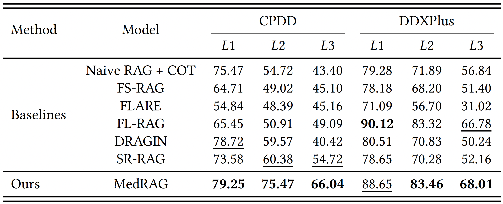
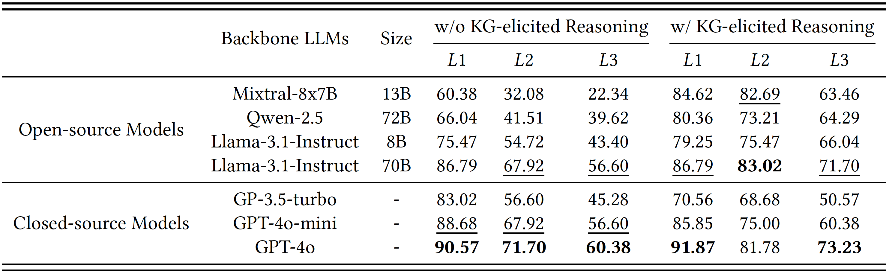
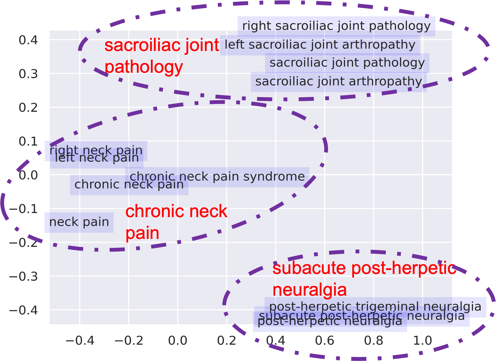
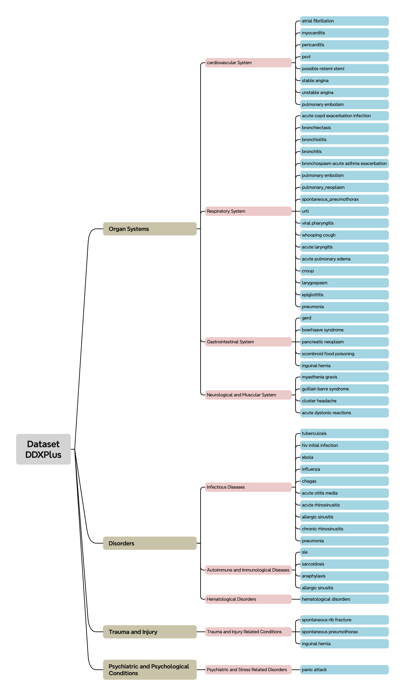
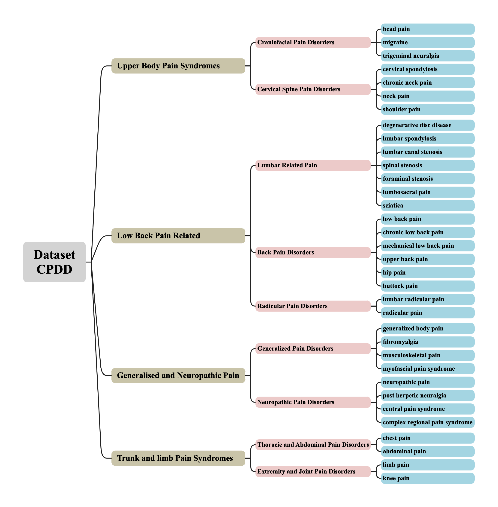
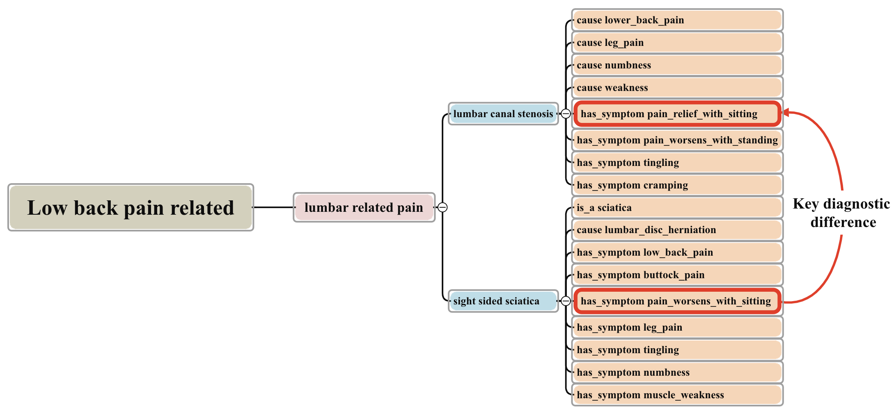

# MedRAG: Enhancing Retrieval-augmented Generation with Knowledge Graph-Elicited Reasoning for Healthcare Copilot

### Project Authors
*Xuejiao Zhao\**,  *Siyan Liu\**,  *Su-Yin Yang*,  *Chunyan Miao\*\**


\* Both authors contributed equally to the paper

\*\* Corresponding author

---

## Overview
**MedRAG** is to designed to enhance **Retrieval-Augmented Generation** (RAG) models by integrating **Knowledge Graph (KG)-elicited reasoning**, specifically for the medical domain. This model helps healthcare professionals generate diagnosis and treatment recommendations based on patient manifestations, improving diagnostic accuracy and reducing the risk of misdiagnosis, particularly for diseases with similar manifestations.

Key features of MedRAG include:

- **Knowledge Graph-Enhanced Reasoning**: Integrates a diagnostic knowledge graph to improve the reasoning ability of the RAG model.
- **Accurate Diagnostic Support**: Provides specific diagnostic insights and personalized treatment recommendations, even for complex or similar diseases.
- **Follow-Up Question Generation**: Proactively generates relevant follow-up questions to clarify ambiguous patient information and enhance decision-making.
- **Evaluated on Real-World and Public Datasets**: Demonstrated superior performance on the public DDXPlus dataset and a private chronic pain diagnostic dataset (CPDD) compared to existing RAG models.

---

## Core Design of MedRAG: Knowledge Graph-Elicited Reasoning

The MedRAG approach addresses the following key challenges:

1. **Knowledge Graph Construction**: Using hierarchical aggregation to build disease knowledge graph, capturing complex relationships between diseases, categories, and their manifestations.
2. **RAG-Based Reasoning**: Combines EHR retrieval with diagnostic knowledge graph reasoning to enhance diagnostic accuracy.
3. **Personalized Diagnostic Suggestions**: Integrates multi-level information to provide personalized treatment and follow-up questions for doctors.

---

## Dataset

The full MedRAG test set, including raw image data and annotations, can be downloaded from the links below. Due to the large size of the dataset, a lighter version is also available for quicker testing.

- [Download Full DDXPlus](https://figshare.com/articles/dataset/DDXPlus_Dataset_English_/22687585) : a large-scale, synthesized EHR dataset widely recognized for offering complex, diverse medical diagnosis cases. It includes comprehensive patient data such as socio-demographic information, underlying diseases, symptoms, and antecedents.
- CPDD: a private EHR dataset in chronic pain from a cooperative hospital.

## Usage

To use MedRAG, follow these steps:

1. **Get ready for repository and dependencies**  
   Clone this repository to your local machine and install requirements in requirements.txt

   ```bash
   git clone https://github.com/yourusername/yourrepository.git
   
   cd yourrepository
   pip install -r requirements.txt
2. **Modify Tokens**  
   To use your own OpenAI and Hugging Face API tokens, replace the placeholders in the `authentication.py` with your actual tokens. The relevant sections in the code have been left blank for this purpose.
   
   ```python
   # Replace with your OpenAI API token
   api_key = "your_openai_api_token"   
  
   # Replace with your Hugging Face API token
   hf_token = "your_huggingface_api_token"
4. **Run the `main.py` script**  
   Once the paths and tokens have been updated, run the `main.py` file to start the program:
   
   ```python
   python main.py

## Experimental Results
### Main results


<div align="center">  </div >
    <p><em>Figure 1: Results of quantitative performance comparison.</em></p >

Our proposed MedRAG achieved the best or second-best~(with only one exception) performance across multiple metrics in all datasets. Accuracy on the $L3$ metric is the best indicator of MedRAG's performance, as higher specificity increases diagnostic difficulty. MedRAG outperformed the second-best scores on the CPDD and DDXPlus datasets.

<div align="center">  </div >
    <p><em>Figure 2: Performance of MedRAG on different LLM backbones with and without KG-elicited reasoning.</em></p >

We evaluate KG-elicited reasoning on different LLM backbones, including both open-source and closed-source models. The results demonstrate that the inclusion of KG-elicited reasoning significantly enhances diagnostic accuracy across $L1$, $L2$, and $L3$ for all backbone LLMs, compared to models without its use.

### Additional Visualizations
**Clustering result**

<div align="center">  </div >
    <p><em>The result of disease clustering in CPDD.</em></p >
    
**Diseases knowledge graph**
<div align="center">  </div >
    <p><em>The result of hierarchical aggregation in DDXPlus.</em></p >
    
<div align="center">  </div >
    <p><em>The result of hierarchical aggregation in CPDD.</em></p >

**Diagnostic differences augmentation**
<div align="center">  </div >
    <p><em>Diagnosic difference example.</em></p >
While lumbar canal stenosis and sciatica share some similar features, the critical distinguishing factor lies in the response to sitting. In lumbar canal stenosis, features are typically alleviated when sitting, whereas in sciatica, sitting tends to exacerbate the discomfort. 


