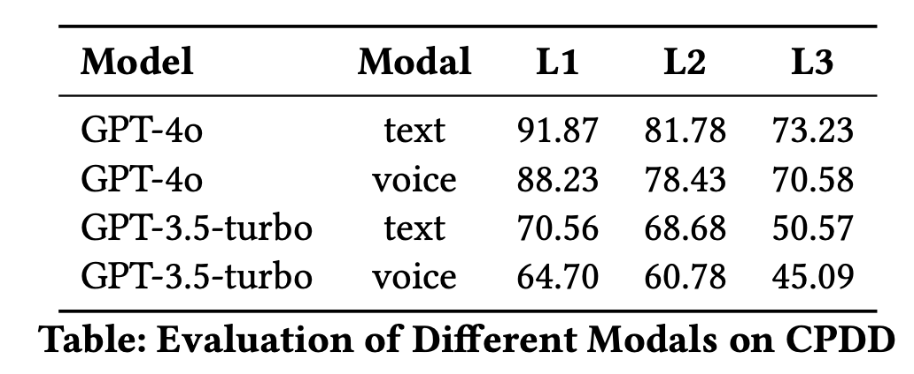
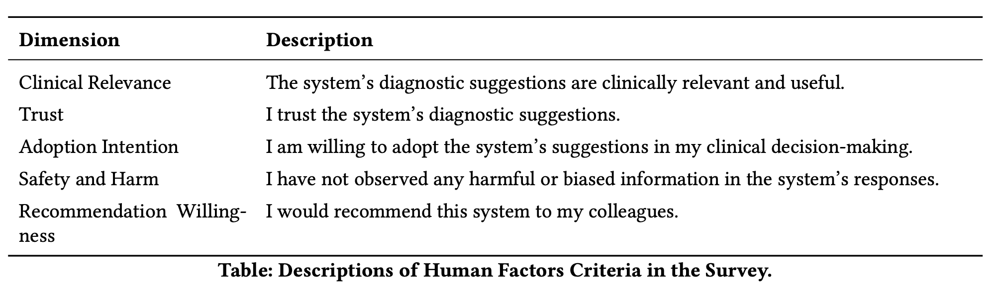
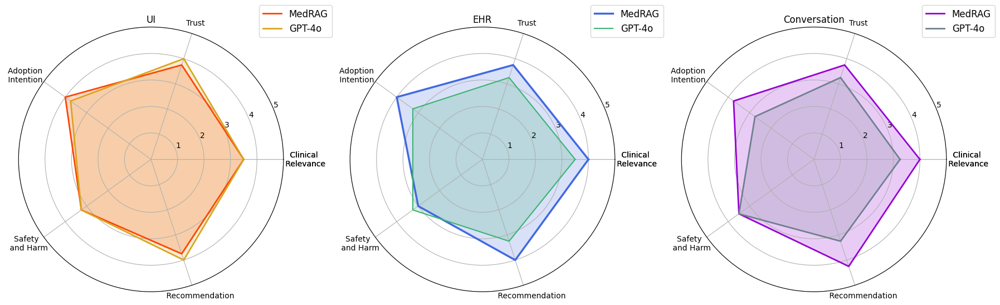

# Appendix of Paper "A Smart Multimodal Healthcare Copilot with Powerful LLM Reasoning"

## Appendix A. Demonstration Scenario

### Medical Consultation and Suggested Follow-up Question

| **Speaker**     | **Medical Consultation**                                                                 |
|------------------|------------------------------------------------------------------------------------------|
| *Dr. Smith*      | Can you describe the pain? Does it stay in one spot or spread to other areas?          |
| *Mr. Johnson*    | It starts in my lower back but spreads down my left buttock and leg.                   |
| *Dr. Smith*      | Do you feel any numbness, tingling, or weakness in your leg?                           |
| *Mr. Johnson*    | Sometimes my leg feels numb or tingles, especially after sitting for a long time.      |

---

**MedRAG-Suggested Follow-Up Question**

| **Speaker**     | **Follow-Up Question**                                                                  |
|------------------|------------------------------------------------------------------------------------------|
| *Dr. Smith*      | Does your pain worsen when standing or when sitting?                                   |
| *Mr. Johnson*    | Standing.                                                                               |

---

Lower back pain is a common complaint in chronic pain management, with multiple potential causes. Among them, lumbar spinal stenosis and sciatica share many overlapping manifestations, including radiating pain, numbness, and discomfort in the lower extremities. This similarity often makes differential diagnosis challenging, especially for less experienced physicians who must rely on precise questioning to uncover key distinguishing features.

Before beginning the consultation, Dr. Smith, a junior chronic pain specialist, initiates a session in MedRAG and activates real-time monitoring. MedRAG is pre-configured with three years of departmental EHR data. The system continuously transcribes her conversation with Mr. Johnson, who reports persistent lower back and leg pain. The recorded medical consultation is presented in the table above.

As the conversation progresses, MedRAG analyzes the dialogue, identifies missing critical information, and suggests a key diagnostic question to Dr. Smith. It then integrates the patient's response into the LLM context. MedRAG differentiates lumbar spinal stenosis from sciatica, noting that pain worsening while standing indicates spinal stenosis, whereas prolonged sitting aggravates sciatica. Based on this, the system generates a preliminary diagnosis, suggesting Mr. Johnson is more likely suffering from lumbar spinal stenosis.

## Appendix B. End-to-End Evaluation of Speech-to-Text Integration

To assess the practical applicability of MedRAG in real clinical settings, we conducted an end-to-end evaluation of the speech-to-text (STT) integration module. This evaluation focused on simulating realistic doctor-patient conversations and measuring the system's ability to process and understand spoken medical information.

We utilized GPT-4 to transform structured EHRs into natural, multi-turn dialogues between doctors and patients. The generated dialogues covered various medical scenarios and included typical clinical terminology and expressions. These simulated dialogues were then converted to speech input, processed by the STT module, and fed into MedRAG's LLM component for final disease diagnosis accuracy evaluation. The results are shown in Figure.

  

    
<em>The result of different modalities in CPDD.</em>

The evaluation results revealed that the STT module successfully captured the majority of medical terminology while preserving some natural language variations and speech patterns. The LLM component demonstrated robust error tolerance, maintaining reasonable diagnostic accuracy despite potential transcription errors. Notably, the system maintained consistent diagnostic accuracy regardless of the input format (text vs. speech), suggesting that the LLM's strong language understanding capabilities effectively compensated for any STT-related errors. It's important to note that this evaluation focused solely on disease diagnosis accuracy, independent of the STT module's performance metrics. The results demonstrate that MedRAG can effectively process and understand spoken medical information while maintaining its diagnostic capabilities.

## Appendix C. Doctor Evaluation
We incorporated a human evaluation involving four experienced doctors. These experts' feedback provides essential perspective on functional design, user interface, EHR analysis, and medical consultation analysis. The table below shows the five human factors criteria and specific questions.

  

In this evaluation, we compare the performance of our MedRAG system with the state-of-the-art LLM, GPT-4o. The comparative results are illustrated in the figure below.

  

In the UI module, both systems demonstrated similar performance, with MedRAG showing a slight edge in Trust and Adoption Intention. This suggests that MedRAG’s interface design is perceived as marginally more intuitive and clinically usable. In the EHR module, MedRAG clearly outperformed GPT-4o across all five dimensions, particularly in Clinical Relevance and Recommendation. This reflects the system’s tailored design for structured clinical data interpretation and higher reliability in decision support. In the Conversation Monitoring module, MedRAG again achieved consistently higher scores, especially in Trust, Adoption Intention, and Recommendation. The results suggest that MedRAG’s ability to generate real-time follow-up suggestions during consultations is viewed as more clinically aligned and acceptable.

